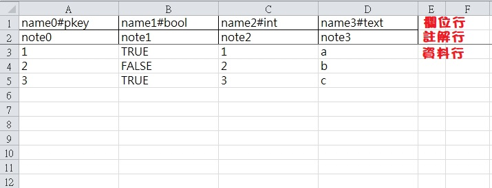
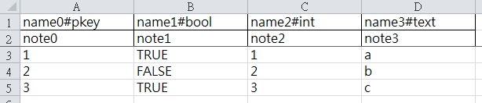

# Sheeter
用Go做成的excel轉換工具  
用於將按照格式做好的excel轉換為json格式  
轉換時會自動產生c++/c#/go的結構程式碼, 就不必再手寫了  

# 如何執行
配置好yaml格式的設定檔與excel檔案  
執行 sheeter build 設定檔.yaml

# 如何寫設定檔
```
global:
  excelPath: .\                 # excel檔案的路徑
  cppLibraryPath: nlohmann\json # c++使用的json函式庫路徑
  bom: true                     # 輸出的檔案是否含BOM
  lineOfField: 1                # excel表格中欄位行位置, 從1起算
  lineOfNote: 2                 # excel表格中註解行位置, 從1起算
  lineOfData: 3                 # excel表格中資料從哪行開始, 從1起算

elements:
  - excel: excel1.xlsx          # 要轉換的excel檔名
    sheet: Data                 # 要轉換的表格名稱
  - excel: excel2.xlsx
    sheet: Data
  - excel: excel3.xlsx
    sheet: Data
```

# 如何寫excel檔案


## 欄位行
欄位的格式為`名稱#格式`, 空格之後的欄位不會輸出
目前支援的格式列於下表
| 格式        | 說明                                 |
|:------------|:-------------------------------------|
| empty       | 不會輸出的欄位                       |
| pkey        | 表格主要索引, 編號可跳號但是不可重複 |
| bool        | 布林值                               |
| boolArray   | 以逗號分隔的布林值陣列               |
| int         | 32位元整數                           |
| intArray    | 以逗號分隔的32位元整數陣列           |
| long        | 64位元整數                           |
| longArray   | 以逗號分隔的64位元整數陣列           |
| float       | 32位元浮點數                         |
| floatArray  | 以逗號分隔的32位元整數陣列           |
| double      | 64位元浮點數                         |
| doubleArray | 以逗號分隔的64位元整數陣列           |
| text        | 字串                                 |
| textArray   | 以逗號分隔的字串陣列                 |

## 註解行
單行註解, 若為空格就輸出空註解

## 資料行
依照格式填寫相應的內容即可, 其中`empty, text, textArray`這三種格式允許空格, 其他格式的空格會造成錯誤  
另外空表格(也就是沒有任何資料行)是允許的

## 轉換檔名規則
如果excel檔案名稱為example.xlsx, 表格名稱為data
json檔案名稱: exampleData.json
json的c++檔案名稱: exampleData.hpp
json的c++結構名稱: ExampleData
json的c#檔案名稱: exampleData.cs
json的c#結構名稱: ExampleData
json的go檔案名稱: exampleData.go
json的go結構名稱: ExampleData

## 其他的限制
* 表格必須有欄位行與註解行, 但是可以不需要有資料行
* 欄位行與註解行必須在資料行之前
* 設定檔中必須設定好欄位行, 註解行, 資料行的位置; 設定時要注意行數是從1開始的
* 表格必須有`pkey`欄位
* 表格只能有一個`pkey`欄位
* `pkey`欄位中的內容不能重複
* 欄位名稱不能重複(包括`empty`欄位)
* 系統得先安裝`go`與`go fmt`

# 轉換範例


json檔案
```
[
    {
        "name0": 1,
        "name1": true,
        "name2": 1,
        "name3": "a"
    },
    {
        "name0": 2,
        "name1": false,
        "name2": 2,
        "name3": "b"
    },
    {
        "name0": 3,
        "name1": true,
        "name2": 3,
        "name3": "c"
    }
]
```

json/c++檔案
```
// generation by sheeter ^o<
// use nlohmann json library
// github: https://github.com/nlohmann/json

#pragma once

#include <stdint.h>
#include <string>
#include <vector>

#include "nlohmann"

namespace Sheeter {
using nlohmann::json;

#ifndef PKEY
#define PKEY
using pkey = int32_t;
#endif // !PKEY

struct RealData { 
    Sheeter::pkey Name0; // note0
    bool Name1; // note1
    int32_t Name2; // note2
    std::string Name3; // note3

    static std::string get_filename() {
        return "realData.json"
    }
};

inline json get_untyped(const json& j, const char* property) {
    return j.find(property) != j.end() ? j.at(property).get<json>() : json();
}
} // namespace Sheeter

namespace nlohmann {
inline void from_json(const json& _j, struct Sheeter::RealData& _x) { 
    _x.Name0 = _j.at("Name0").get<Sheeter::pkey>();
    _x.Name1 = _j.at("Name1").get<bool>();
    _x.Name2 = _j.at("Name2").get<int32_t>();
    _x.Name3 = _j.at("Name3").get<std::string>();
}

inline void to_json(json& _j, const struct Sheeter::RealData& _x) { 
    _j = json::object();
    _j["Name0"] = _x.Name0;
    _j["Name1"] = _x.Name1;
    _j["Name2"] = _x.Name2;
    _j["Name3"] = _x.Name3;
}
} // namespace nlohmann
```

json/c#檔案
```
// generation by sheeter ^o<

using System;
using System.Collections.Generic;

namespace Sheeter {
    public class RealData { 
        public const string fileName = "realData.json";
        public int Name0; // note0
        public bool Name1; // note1
        public int Name2; // note2
        public string Name3; // note3
    }
} // namespace Sheeter
```

json/go檔案
```
// generation by sheeter ^o<

package sheeter

const RealDataFileName = "realData.json" // json file name

type RealData struct {
	Name0 int32  // note0
	Name1 bool   // note1
	Name2 int32  // note2
	Name3 string // note3
}
```

# 專案目錄說明
* Sheeter: 轉檔工具專案
* Docs: 說明文件

# TODO
* 產生proto message
* 產生proto bytes data
* 產生proto/c++ code
* 產生proto/cs code
* 產生proto/go code
* 新增json/c++驗證子專案
* 新增json/cs驗證子專案
* 新增json/go驗證子專案
* 新增proto/c++驗證子專案
* 新增proto/cs驗證子專案
* 新增proto/go驗證子專案
