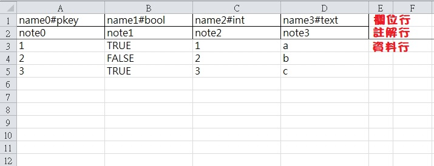

# Sheeter
以Go做成的excel轉換工具, 前身是[Sheet](https://github.com/yinweli/Sheet)  
用於將按照格式做好的excel轉換為json格式  
轉換時會自動產生c#/go的結構程式碼, 就不必再手寫了  

# 如何安裝
先安裝[Go](https://go.dev/dl/), 然後在終端執行
```
go install github.com/yinweli/Sheeter/cmd/sheeter@latest
```

# 如何執行
配置好yaml格式的設定檔與excel檔案, 然後在終端執行
```
sheeter build 設定檔.yaml
```

# 如何寫設定檔
```
global:
  excelPath: .\                     # excel檔案的路徑
  bom: true                         # 輸出的檔案是否要用BOM
  lineOfField: 1                    # excel表格中欄位行位置, 從1起算
  lineOfNote: 2                     # excel表格中註解行位置, 從1起算
  lineOfData: 3                     # excel表格中資料從哪行開始, 從1起算

elements:
  - excel: excel1.xlsx              # 要轉換的excel檔名
    sheet: Data                     # 要轉換的表格名稱
  - excel: excel2.xlsx
    sheet: Data
  - excel: excel3.xlsx
    sheet: Data
```

# 如何寫excel檔案


## 欄位行
欄位的格式為`名稱#格式`, 空格之後的欄位不會輸出
目前支援的格式列於下表
| 格式        | 說明                                 |
|:------------|:-------------------------------------|
| empty       | 不會輸出的欄位                       |
| pkey        | 表格主要索引, 編號可跳號但是不可重複 |
| bool        | 布林值                               |
| boolArray   | 以逗號分隔的布林值陣列               |
| int         | 32位元整數                           |
| intArray    | 以逗號分隔的32位元整數陣列           |
| long        | 64位元整數                           |
| longArray   | 以逗號分隔的64位元整數陣列           |
| float       | 32位元浮點數                         |
| floatArray  | 以逗號分隔的32位元整數陣列           |
| double      | 64位元浮點數                         |
| doubleArray | 以逗號分隔的64位元整數陣列           |
| text        | 字串                                 |
| textArray   | 以逗號分隔的字串陣列                 |

## 註解行
單行註解, 若為空格就輸出空註解

## 資料行
依照格式填寫相應的內容即可, 其中`empty`, `text`, `textArray`這三種格式允許空格, 其他格式的空格會造成錯誤  
空表格(也就是沒有任何資料行)是允許的
轉換時, 只會轉換到第一個空行為止

## 轉換檔名規則
如果excel檔案名稱為`example.xlsx`, 表格名稱為`data`  
* json檔案名稱: `exampleData.json`
* json的c#檔案名稱: `exampleData.cs`
* json的c#結構名稱: `ExampleData`
* json的go檔案名稱: `exampleData.go`
* json的go結構名稱: `ExampleData`

## 其他的限制
* 表格必須有欄位行與註解行, 但是可以不需要有資料行
* 欄位行與註解行必須在資料行之前
* 設定檔中必須設定好欄位行, 註解行, 資料行的位置; 設定時要注意行數是從1開始的
* 表格必須有`pkey`欄位
* 表格只能有一個`pkey`欄位
* `pkey`欄位中的內容不能重複
* 欄位名稱不能重複(包括`empty`欄位)
* 表格中寫布林值時, 請寫true/false
* c#程式碼的命名空間為`Sheeter`
* c#程式碼使用Newtonsoft.Json來轉換json
* go程式碼的軟體包名為`sheeter`
    * 這代表你得把產生出來的go程式碼放在`\sheeter`目錄下

# 轉換範例


json檔案
```
{
    "1": {
        "name0": 1,
        "name1": true,
        "name2": 1,
        "name3": "a"
    },
    "2": {
        "name0": 2,
        "name1": false,
        "name2": 2,
        "name3": "b"
    },
    "3": {
        "name0": 3,
        "name1": true,
        "name2": 3,
        "name3": "c"
    }
}
```

json/c#檔案
```
// generation by sheeter ^o<, from real.xlsx(Data)
using Newtonsoft.Json;
using System;
using System.Collections.Generic;
using System.Text;

namespace Sheeter {
    public class RealData { 
        public const string fileName = "realData.json";
        public int name0; // note0
        public bool name1; // note1
        public int name2; // note2
        public string name3; // note3

        public static Dictionary<int, RealData> Parse(string s) {
            return JsonConvert.DeserializeObject<Dictionary<int, RealData>>(s);
        }

        public static Dictionary<int, RealData> Parse(byte[] b)
        {
            return Parse(Encoding.UTF8.GetString(b));
        }
    }
} // namespace Sheeter
```

json/go檔案
```
// generation by sheeter ^o<, from real.xlsx(Data)
package sheeter

import "encoding/json"

const RealDataFileName = "realData.json" // json file name

type RealData struct {
	Name0 int32  ` + "`json:\"name0\"`" + ` // note0
	Name1 bool   ` + "`json:\"name1\"`" + ` // note1
	Name2 int32  ` + "`json:\"name2\"`" + ` // note2
	Name3 string ` + "`json:\"name3\"`" + ` // note3
}

type RealDataMap map[int]RealData

func (this *RealDataMap) ParseString(s string) error {
	return json.Unmarshal([]byte(s), this)
}

func (this *RealDataMap) ParseBytes(b []byte) error {
	return json.Unmarshal(b, this)
}
```

# 其他目錄說明
* .readme: 存放說明文件的連結檔案

# TODO
* 新增輸出lua格式  
  ExcelData={  
  [1010001] = {id=1010001,name="M4A1",short_name="M4A1",Test={{is_plural=0,Testdd={{max_plural_num=100000000,rarity=1},{max_plural_num=100000000,rarity=1}},desc="各种军事组织广泛使用的突击步枪，性能稳定，适合新手。",color=0,desc_list= {92,23,35}}},resource=1010001,type=1,up_shelves_time=1439262000,off_shelves_time=1597287600,is_time_limit=0},  
  [1010002] = {id=1010002,name="AR6游骑兵",short_name="AR6游骑兵",Test={{is_plural=1,Testdd={{max_plural_num=100000000,rarity=2},{max_plural_num=100000000,rarity=2}},desc="新一代标准不强，杀伤力提高，射击稳定",color=0,desc_list= {92,23,35}}},resource=1010002,type=1,up_shelves_time=1439262000,off_shelves_time=1597287600,is_time_limit=0},  
  [1010003] = {id=1010003,name="Kar-M",short_name="Kar-M",Test={{is_plural=0,Testdd={{max_plural_num=100000000,rarity=2},{max_plural_num=100000000,rarity=2}},desc="拥有大容量的弹夹的突击步枪，具有更加持续的连射火力。",color=0,desc_list= {92,23,35}}},resource=1010003,type=1,up_shelves_time=1439262000,off_shelves_time=1597287600,is_time_limit=0},  
  [1010004] = {id=1010004,name="亡魂SCAR",short_name="亡魂SCAR",Test={{is_plural=0,Testdd={{max_plural_num=100000000,rarity=3},{max_plural_num=100000000,rarity=3}},desc="射速极快的突击步枪，单位时间内能向目标发射更多的子弹。",color=0,desc_list= {92,23,35}}},resource=1010004,type=1,up_shelves_time=1439262000,off_shelves_time=1597287600,is_time_limit=0},  
  [1010005] = {id=1010005,name="RFB-死神",short_name="RFB-死神",Test={{is_plural=0,Testdd={{max_plural_num=100000000,rarity=3},{max_plural_num=100000000,rarity=3}},desc="采用无托设计的突击步枪，后坐力小，射击稳定。",color=0,desc_list= {92,23,35}}},resource=1010005,type=1,up_shelves_time=1439262001,off_shelves_time=1597287600,is_time_limit=0},  
  [1010006] = {id=1010006,name="银河轻骑士",short_name="银河轻骑士",Test={{is_plural=0,Testdd={{max_plural_num=100000000,rarity=3},{max_plural_num=100000000,rarity=3}},desc="发射特殊子弹，在穿透掩体后，还能造成可怕的伤害。",color=0,desc_list= {92,23,35}}},resource=1010006,type=1,up_shelves_time=1439262002,off_shelves_time=1597287600,is_time_limit=0},  
  }
* 產生proto message
* 產生proto bytes data
* 產生proto/cs code
* 產生proto/go code
* 新增proto/cs驗證子專案
* 新增proto/go驗證子專案
* 新增lua驗證子專案

# 改進方向
excel => json schema (自己來)
excel => json data (自己來)
json => c++ (quicktype)
json => c# (quicktype)
json => go (quicktype)
json => lua ?

表格名稱用 描述|表格名 的方式比較好, 程式內只使用表格名來製作檔案 ex: 英雄表|Hero, 道具表|Item
表格結構仍然不使用結構(欄位格式不好弄)
轉換程式碼的方式改用quicktype工具

** how to install quicktype
1.install npm
https://nodejs.org/en/

2.+npm to path

3.install quicktype
npm install -g quicktype

** quicktype >> c++
quicktype --src verifyData.json --src-lang json --top-level verifyDatas
          --out verifyData.hpp --lang c++
          --namespace sheeter

** quicktype >> c#
quicktype --src verifyData.json --src-lang json --top-level verifyDatas
          --out verifyData.hpp --lang cs
          --namespace sheeter
          --array-type array

** quicktype >> go
quicktype --src verifyData.json --src-lang json --top-level verifyDatas
          --out verifyData.go --lang go
          --package sheeter
          
** other ref
c# code for json to lua 
https://github.com/yomunsam/Json2LuaTable/blob/master/Json2Lua/Program.cs

lua code for lua table to file
http://lua-users.org/wiki/SaveTableToFile

json to lua table
https://github.com/layeh/gopher-json

quicktype
https://github.com/yomunsam/Json2LuaTable/blob/master/Json2Lua/Program.cs