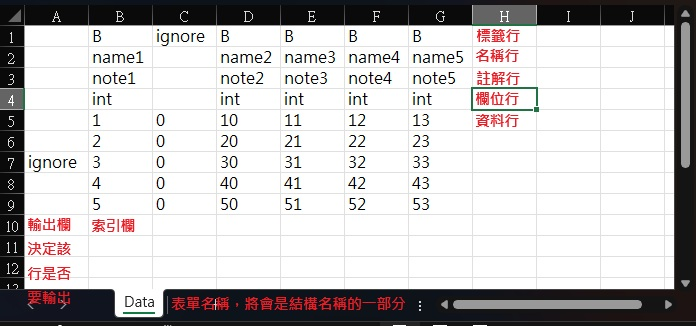

# Sheeter
[sheeter]是一款使用[go]語言開發的excel轉換工具  
它能將特定格式的excel文件轉換成JSON數據文件, 並生成用於讀取這些數據文件的c#或go程式碼  
這款工具的前身為[sheet]

# 系統需求
- [go]1.19以上

# 從安裝包安裝
您可以在GitHub頁面的`Releases`部分找到適合不同平台的安裝壓縮包  
下載並解壓縮這些文件之後, 即可開始使用

# 從原始碼安裝
- 確保在您的系統上安裝了go語言
- 在終端機中執行以下命令以安裝最新版本
   ```sh
   go install github.com/yinweli/Sheeter/v2/cmd/sheeter@latest
   ```
- 或是如果需要安裝舊版的[sheeter], 可以使用以下命令安裝舊版本
   ```sh
   go install github.com/yinweli/Sheeter/cmd/sheeter@latest
   ```
   請注意, [sheeter]的v2版本與v1版本的excel格式不相容, 因此這兩個版本之間無法互相讀取excel文件

# 如何使用
以下是使用[sheeter]工具的步驟, 旨在指導您如何從excel檔案生成程式碼和JSON資料

- 建立資料表單
  - 首先, 您需要建立一個excel檔案, 詳細規範和格式請參考[資料表單說明](#資料表單說明)。
- 建立設定檔案
  - 根據您的需求建立一個設定檔案, 具體設定詳情請見[設定檔](#設定檔)  
    這個檔案將指導[sheeter]如何讀取和處理excel檔案
- 執行建置命令
  - 在終端機中執行以下命令來生成所需的程式碼檔案和JSON資料檔
    ```sh
    sheeter build --config 設定檔案
    ```
  - 確保替換`設定檔案`為您的實際設定檔案路徑
- 產生檔案
  - 執行上述命令後, [sheeter]將會產生以下檔案
    - 程式碼檔案: 分別為`.cs`或`.go`格式, 用於操作和處理JSON資料
    - JSON文字檔案: 轉換後的資料將保存在`.json`格式的檔案中

透過這些步驟, 您可以有效地將excel數據轉換成程式可讀的格式, 並根據需要進行處理和應用

# 範例
在專案的`support/example`目錄中, 您可以找到範例文件及其相應的目錄  
以下表格詳細說明了每個目錄/檔案的用途

| 目錄/檔案            | 說明                              |
|:---------------------|:----------------------------------|
| config.yaml          | 提供範例的設定檔案                |
| excel/example.xlsx   | 包含範例數據的excel檔案           |
| sheet/codeCs         | 包含由sheeter產生的c#版本程式碼   |
| sheet/codeGo         | 包含由sheeter產生的go版本程式碼   |
| sheet/json           | 包含由excel轉換產生的JSON資料檔案 |
| code/example.cs.code | 用於示範的c#版本程式碼            |
| code/example.go.code | 用於示範的go版本程式碼            |

# 命令說明
[sheeter]工具提供了多個命令和旗標, 這些功能使您能夠更靈活地控制文件的轉換過程  
以下是常用命令和旗標的詳細說明

## build 命令說明
這個命令用於建置資料檔案與程式碼
```sh
sheeter build [flags]
```

例如
```sh
sheeter build --config setting.yaml
sheeter build --config setting.yaml --lineOfField 1 --lineOfData 2
```

### 設定檔
這個YAML設定檔定義了各種執行細節
```yaml
source:                              # 輸入列表
  - path1                            # 處理path1目錄下符合規格的excel檔案
  - path2                            # 處理path2目錄下符合規格的excel檔案
  - path/excel.xlsx                  # 處理指定excel檔案中符合規格的工作表
merge:                               # 合併列表
  - merge1$excel1#sheet&excel2#sheet # 將 excel1#sheet 和 excel2#sheet 合併為merge1
  - merge2$excel3#sheet&excel4#sheet
exclude:                             # 排除列表
  - excel2.xlsx#sheet                # 排除指定excel檔案的特定工作表
output: path/output                  # 輸出路徑
tag: cs                              # 標籤字符串
autoKey: true                        # 自動選取索引
lineOfTag: 5                         # 標籤行號(從第1行開始)
lineOfName: 1                        # 名稱行號(從第1行開始)
lineOfNote: 2                        # 註解行號(從第1行開始)
lineOfField: 3                       # 欄位行號(從第1行開始)
lineOfData: 6                        # 資料行號(從第1行開始)
```

### 命令旗標
| 旗標          | 參數                                      | 說明                 |
|:--------------|:------------------------------------------|:---------------------|
| --config      | 路徑與檔名, 例如: path/seeting.yaml       | 指定設定檔案路徑     |
| --source      | 路徑, 檔案名稱                            | 輸入列表             |
| --merge       | name$excel.xlsx#sheet&excel.xlsx#sheet... | 合併列表             |
| --exclude     | excel.xlsx#sheet, excel.xlsx#sheet...     | 排除列表             |
| --output      | 路徑                                      | 輸出路徑             |
| --tag         | 標籤列表                                  | 指定標籤的欄位輸出   |
| --autoKey     | true/false                                | 是否啟用自動選取索引 |
| --lineOfTag   | 行號(從第1行開始)                         | 標籤行號             |
| --lineOfName  | 行號(從第1行開始)                         | 名稱行號             |
| --lineOfNote  | 行號(從第1行開始)                         | 註解行號             |
| --lineOfField | 行號(從第1行開始)                         | 欄位行號             |
| --lineOfData  | 行號(從第1行開始)                         | 資料行號             |

這些命令旗標可以通過指定的設定檔案提供, 或者可以直接通過命令行參數來覆蓋, 例如:
```sh
sheeter build --config setting.yaml --lineOfName 5
```
這樣, `lineOfName`的設定將由命令行參數中的值覆蓋

### --source
此選項定義了輸入列表, 允許使用不同格式的組合, 每個項目需用逗號(`,`)分隔  
程式僅處理副檔名為`.xlsx`的檔案, 並且在指定路徑時應使用斜線(`/`)而非反斜線(`\`)

可接受的輸入格式包括
- 路徑名稱: 可以是單一目錄或包含多級目錄的路徑, 例如: `path`, `path/`, `path/path`...
- 檔案名稱: 指定單一檔案或含路徑的檔案名稱, 例如: `example.xlsx`, `path/example.xlsx`...

### --merge
此選項允許將指定的工作表合併成一個新的表格讀取器  
要合併的工作表必須已列在輸入列表中, 且它們的格式必須完全相同  
新建立的表格讀取器的名稱不能與現有的名稱重複, 否則可能導致錯誤  
重要的是, 合併操作不會取代原有的表格讀取器, 而是會創建一個全新的表格讀取器來存储合併後的資料  

合併列表的語法
```
[新表格讀取器名稱]$[excel名稱#工作表名稱]&[excel名稱#工作表名稱]&...
[新表格讀取器名稱]$[excel名稱.xlsx#工作表名稱]&[excel名稱.xlsx#工作表名稱]&...
```

例如: `name1$excel1#sheet&excel2#sheet`  
這將建立一個名為 name1 的新表格讀取器, 其中包含來自 excel1#sheet 和 excel2#sheet 的合併資料

### --exclude
此選項設定一個排除列表, 用於指定不希望輸出的工作表, 在這個列表中指定的表單將不會被處理或輸出  
列表中的每個項目應以逗號(`,`)分隔, 並使用特定格式來確定哪些工作表被排除: 使用excel檔案名(不包括路徑和副檔名)和工作表名稱, 二者之間以井號(`#`)連接

合併列表的語法
```
[excel名稱#工作表名稱], [excel名稱#工作表名稱], ...
```

例如: `excel#sheet`  
指定將名為 sheet 的工作表從名為 excel 的excel文件中排除  
這樣, 這些指定的工作表將不會在最終輸出中出現

### --output
此選項指定輸出路徑, 確定生成的文件將存儲在哪個位置  
這允許用戶自定義文件輸出的目標目錄, 以便於管理和存取生成的數據文件

### --tag
此選項使用標籤字符串來控制哪些欄位應該被輸出  
標籤行的使用提供了一種過濾和精確指定輸出數據的方法  
用戶可以根據特定的需求設定標籤, 從而只輸出包含這些標籤的數據欄位

### --autoKey
此選項控制是否自動選擇索引來標識數據行
- 當不啟用自動索引時: 系統將使用表格中的`pkey`, `lkey`或`skey`欄位作為主要索引
- 啟用自動索引時: 將自動選擇表格中的第二列作為主索引, 如果第二列的數據類型不是`int`, `long`或`string`, 則會產生錯誤提示. 這確保了索引的有效性和數據的一致性

## version命令
用於顯示版本資訊  
```sh
sheeter version
```

## help命令
用於顯示命令說明  
```sh
sheeter help [command]
```

# 資料表單說明


## 檔案名稱規則
檔案名稱需要符合以下規則以確保正確處理
- 包含字串`ignore`(不分大小寫)的檔案將被忽略
- 檔案名稱不能為空字串
- 檔案名稱不能以數字開頭
- 允許的字符包括英文字母, 數字, 空格和底線

## 表單名稱規則
表單名稱同樣需遵守特定格式
- 包含字串`ignore`(不分大小寫)的表單將被忽略
- 表單名稱不能為空字串
- 允許的字符包括英文字母, 數字, 空格和底線

## 產生的檔案名稱規則
產生的檔案名稱將根據以下規則進行格式化
- excel名稱: 首字母大寫(c#版本)或小寫(go版本), 移除所有底線或空格, 並將底線或空格後的首字母大寫
- sheet名稱: 首字母大寫, 移除所有底線或空格, 底線或空格後的首字母亦為大寫
- 如果excel名稱與sheet名稱相同, 則僅保留excel名稱

## 標籤行
標籤行控制特定欄位是否應該輸出到資料檔案和程式碼中
- 欄位上的標籤若符合設定檔中的標籤字串, 該欄位將被輸出
- 沒有標籤的欄位不會被輸出
- 包含字串`ignore`(不分大小寫)的標籤不會輸出

## 名稱行
- 欄位名稱必須是英文, 數字和底線的組合, 且不能以數字開頭, 也不允許有空白

## 註解行
- 若註解欄為空格則輸出為空註解, 換行符號將被移除

## 欄位行
欄位類型設定如下, 可用的類型包括
- 主索引: `pkey`, `lkey`, `skey`(使用不同數據類型, 且索引值不能重複)
- 資料類型: 包括布林值, 整數, 長整數, 浮點數, 雙精度浮點數, 字串等, 及其陣列形式

以下是詳細的資料類型列表  

| 類型                            | 說明                                           |
|:--------------------------------|:-----------------------------------------------|
| pkey                            | 表格主要索引, 使用32位元整數類型, 索引不可重複 |
| lkey                            | 表格主要索引, 使用64位元整數類型, 索引不可重複 |
| skey                            | 表格主要索引, 使用字串類型, 索引不可重複       |
| bool                            | 布林值                                         |
| boolArray, []bool, bool[]       | 以逗號分隔的布林值陣列                         |
| int                             | 32位元整數                                     |
| intArray, []int, int[]          | 以逗號分隔的32位元整數陣列                     |
| long                            | 64位元整數                                     |
| longArray, []long, long[]       | 以逗號分隔的64位元整數陣列                     |
| float                           | 32位元浮點數                                   |
| floatArray, []float, float[]    | 以逗號分隔的32位元浮點數陣列                   |
| double                          | 64位元浮點數                                   |
| doubleArray, []double, double[] | 以逗號分隔的64位元浮點數陣列                   |
| string                          | 字串                                           |
| stringArray, []string, string[] | 以逗號分隔的字串陣列                           |

## 資料行
- 根據欄位類型填寫相應的內容
- 空表格(無資料行)是允許的, 第一個空行將視為表格結束

## 輸出欄
- 表格中的第一欄用來決定該行是否要輸出
- 若資料行的第一欄為`ignore`(不分大小寫), 該行不會被輸出

## 其他的限制
- 表格設置必須包括標籤行, 名稱行, 註解行和欄位行, 但可以不包含資料行
- 所有的行設定必須在資料行之前完成, 且在設定檔中行數從1開始
- 每個表格只能有一個主索引欄位, 且索引值不可重複

# 產生目錄
以下是產生目錄的描述, 用於存放不同類型的生成檔案

| 名稱   | 說明                   |
|:-------|:-----------------------|
| codeCs | 存放產生的c#程式碼     |
| codeGo | 存放產生的go程式碼     |
| json   | 存放JSON格式的資料檔案 |

# 格式化程式碼
[sheeter]不直接處理生成檔案的排版, 若需排版使用者需自行撰寫`.bat`或`.sh`腳本來執行相應的格式化工具  
以下是專為c#和go程式碼提供的格式化工具, 包括安裝和使用指南

## csharpier
[csharpier]是專為c#程式碼設計的格式化工具
- 安裝
  - 若未安裝.NET SDK或Unity, 需要先安裝[dotnet]
  - 在終端機中執行以下命令來安裝[csharpier]
    ```sh
    dotnet tool install csharpier -g
    ```
- 使用
  - 在終端機中執行以下命令來格式化目錄中的所有c#檔案
    ```sh
    dotnet csharpier .
    ```

## gofmt
gofmt是go語言的官方格式化工具, 隨go語言環境一同安裝
- 安裝
  - 安裝go語言環境時, `gofmt`會自動被安裝
- 使用
  - 在終端機中執行以下命令來格式化目錄中的所有go檔案
    ```sh
    gofmt -w .
    ```

# 專案目錄說明
| 目錄                | 說明                             |
|:--------------------|:---------------------------------|
| cmd/sheeter         | sheeter命令程式                  |
| cmd/sheeter/build   | 建置表格命令                     |
| cmd/sheeter/version | 顯示版本命令                     |
| sheeter             | sheeter命令程式用到的各項組件    |
| sheeter/builds      | 表格轉換(用於build命令)          |
| sheeter/excels      | 表格組件                         |
| sheeter/fields      | 欄位組件                         |
| sheeter/layouts     | 布局組件                         |
| sheeter/nameds      | 命名工具                         |
| sheeter/pipelines   | 管線組件                         |
| sheeter/tmpls       | 模板組件                         |
| sheeter/utils       | 協助組件                         |
| support             | 支援專案                         |
| support/example     | 範例資料                         |
| support/handmade    | 手製模板, 用來檢查模板是否有錯誤 |
| support/verify      | 驗證專案                         |
| testdata            | 測試資料                         |

# Task命令說明
輸入 `task 命令名稱` 來執行命令, 如果無法使用, 表示還沒有安裝[task]

| 命令名稱       | 命令說明         |
|:---------------|:-----------------|
| lint           | 進行程式碼檢查   |
| test           | 進行程式碼測試   |
| bench          | 進行效能測試     |

# JetBrains licenses
[sheeter]使用了JetBrains的Goland的免費開發許可, 在此表示感謝  


[csharpier]: https://github.com/belav/csharpier
[dotnet]: https://learn.microsoft.com/zh-tw/dotnet/core/sdk
[go]: https://go.dev/dl/
[json]: https://www.json.org/json-en.html
[sheet]: https://github.com/yinweli/Sheet
[sheeter]: https://github.com/yinweli/sheeter
[task]: https://taskfile.dev/
[template]: https://pkg.go.dev/text/template